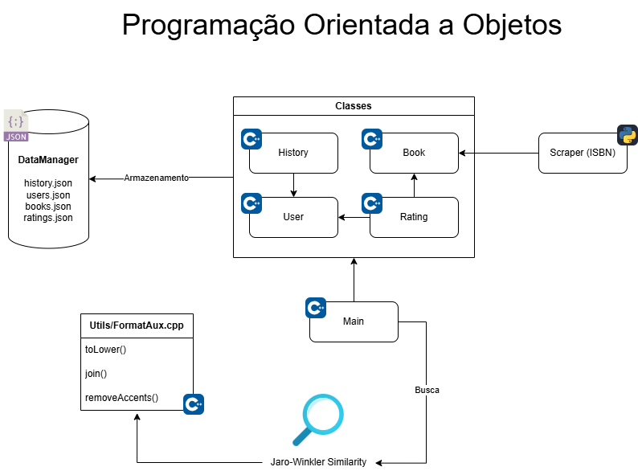

<div align="center">


<br/>
<br/>

*Sua próxima leitura favorita está a um clique de distância*

[](https://isocpp.org/std/the-standard)
[](https://cmake.org/)
[](https://opensource.org/licenses/MIT)

</div>

## 📋 Sobre o Projeto

BookMatch é um sistema de recomendação de livros desenvolvido como projeto final da disciplina de Algoritmos e Estruturas de Dados I (C02) do curso de Engenharia de Telecomunicações do Instituto Nacional de Telecomunicações. O sistema analisa preferências individuais e padrões de leitura de usuários similares para criar recomendações personalizadas.

O projeto aplica conceitos fundamentais do curso (estruturas de dados, condições, repetições e manipulação de arquivos) e expande para tópicos avançados como algoritmos de busca, ordenação e programação orientada a objetos, tudo em um projeto prático e realista.

### 🎯 Objetivos

- Fornecer recomendações personalizadas de livros
- Incentivar o hábito da leitura
- Criar uma comunidade de leitores
- Facilitar a descoberta de novos títulos
- Melhorar a experiência de leitura

## 🚀 Funcionalidades

### Sistema de Usuários
- Cadastro e login de usuários
- Perfil personalizado
- Histórico de leituras
- Lista de desejos
- Avaliações e resenhas

### Sistema de Livros
- Catálogo completo de livros
- Informações detalhadas (título, autor, ISBN, etc.)
- Avaliações e classificações
- Gêneros e categorias
- Descrições e sinopses

### Sistema de Recomendação
- Análise de preferências do usuário
- Recomendações baseadas em comportamento
- Sugestões de usuários similares
- Tendências e popularidade
- Filtros personalizados

<br/>

<div align="center">
  <p><strong>🔧 Diagrama do Projeto</strong></p>
  
</div>

## 🔒 Segurança

- Senhas criptografadas com SHA-512
- Validação de dados de entrada
- Proteção contra injeção de dados
- Sanitização de strings


## 📦 Dependências

- **CMake >= 3.20**
- **Compilador C++20** (g++ 10+, clang 10+, MSVC 2019+)
- **Botan** (criptografia/hash de senha)
- **nlohmann/json** (JSON, incluído automaticamente pelo CMake)
- **tabulate** (tabelas no terminal, incluído automaticamente pelo CMake)

> ⚠️ As dependências nlohmann/json e tabulate são baixadas automaticamente pelo CMake via FetchContent. O Botan deve estar instalado no sistema.

## 🐧 No Linux

### Pré-requisitos

```bash
sudo apt update && sudo apt install -y build-essential cmake libbotan-2-dev
```

### Compilar

```bash
# Clone o repositório e entre na pasta
cd BookMatch
mkdir build
cd build
cmake ..
cmake --build .
```
### Executar

```bash
./BookMatch
```

## 🪟 No Windows

### Pré-requisitos

- Instale o [MSYS2](https://www.msys2.org/) e abra o terminal MSYS2 MinGW 64-bit
- Execute:

```bash
pacman -Syu
pacman -S mingw-w64-x86_64-gcc mingw-w64-x86_64-cmake mingw-w64-x86_64-botan
```

### Compilar

```bash
# No terminal MSYS2 MinGW 64-bit
cd BookMatch
mkdir build
cd build
cmake .. -G "MinGW Makefiles"
cmake --build .
```

### Executar

```bash
./BookMatch.exe
```

> Se preferir usar o Visual Studio, basta abrir a pasta do projeto e usar o CMake integrado, mas o Botan deve estar instalado e configurado no sistema.

<br/>

## 🤝 Contribuindo

1. Faça um Fork do projeto
2. Crie uma Branch para sua Feature (`git checkout -b feature/AmazingFeature`)
3. Commit suas mudanças (`git commit -m 'Add some AmazingFeature'`)
4. Push para a Branch (`git push origin feature/AmazingFeature`)
5. Abra um Pull Request

---

<div align="center">
  Este projeto está disponível sob a licença <a href="LICENSE">MIT</a> 🌍<br/>
  Feito com ❤️ por Rodrigo Andrade
</div>
