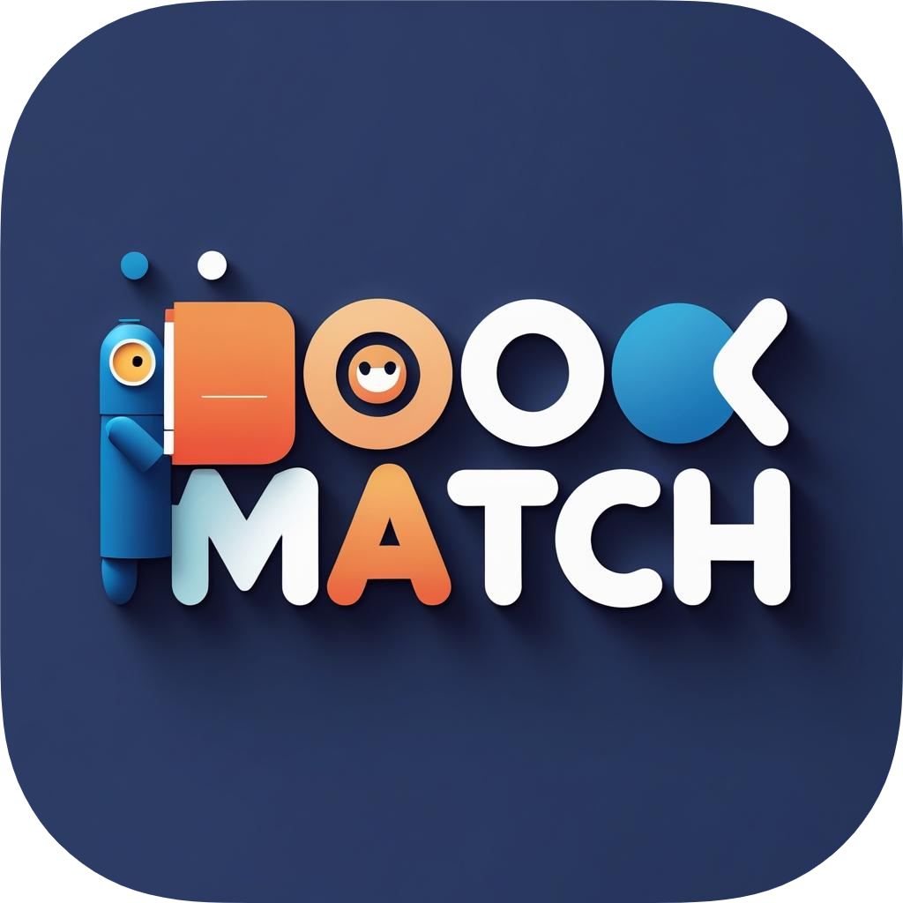

<div align="center">



<br/>
<br/>

*Sua próxima leitura favorita está a um clique de distância*

[](https://isocpp.org/std/the-standard)
[](https://cmake.org/)
[](https://opensource.org/licenses/MIT)

</div>

## 📋 Sobre o Projeto

BookMatch é um sistema de recomendação de livros desenvolvido como projeto final da disciplina de Algoritmos e Estruturas de Dados I (C02) do curso de Engenharia de Telecomunicações do Instituto Nacional de Telecomunicações. O sistema analisa preferências individuais e padrões de leitura de usuários similares para criar recomendações personalizadas.

O projeto aplica conceitos fundamentais do curso (estruturas de dados, condições, repetições e manipulação de arquivos) e expande para tópicos avançados como algoritmos de busca, ordenação e programação orientada a objetos, tudo em um projeto prático e realista.

### 🎯 Objetivos

- Fornecer recomendações personalizadas de livros
- Incentivar o hábito da leitura
- Criar uma comunidade de leitores
- Facilitar a descoberta de novos títulos
- Melhorar a experiência de leitura

## 🚀 Funcionalidades

### Sistema de Usuários
- Cadastro e login de usuários
- Perfil personalizado
- Histórico de leituras
- Lista de desejos
- Avaliações e resenhas

### Sistema de Livros
- Catálogo completo de livros
- Informações detalhadas (título, autor, ISBN, etc.)
- Avaliações e classificações
- Gêneros e categorias
- Descrições e sinopses

### Sistema de Recomendação
- Análise de preferências do usuário
- Recomendações baseadas em comportamento
- Sugestões de usuários similares
- Tendências e popularidade
- Filtros personalizados

## 🛠️ Tecnologias Utilizadas

- **C++17**: Linguagem principal do projeto
- **CMake**: Sistema de build
- **OpenSSL**: Criptografia de senhas
- **UTF-8**: Suporte a caracteres especiais
- **Arquivos de Texto**: Armazenamento de dados

## 📦 Estrutura do Projeto

```Python
BookMatch/
├── src/
│   ├── main.cpp          # Ponto de entrada do programa
│   ├── user.h            # Definição da classe User
│   ├── user.cpp          # Implementação da classe User
│   ├── book.h            # Definição da classe Book
│   ├── book.cpp          # Implementação da classe Book
│   └── data.h            # Gerenciamento de dados
├── data/                 # Diretório de dados
├── assets/              # Recursos do projeto
├── CMakeLists.txt       # Configuração do CMake
└── README.md            # Documentação
```

## 🚀 Como Executar

### Pré-requisitos
- Compilador C++ compatível com C++17
- CMake 3.10 ou superior
- OpenSSL (para criptografia dos dados)

### Compilação
```bash
# Criar diretório de build
mkdir build
cd build

# Configurar CMake
cmake ..

# Compilar
cmake --build .
```

### Execução
```bash
# No diretório build
./BookMatch
```

## 🔒 Segurança

- Senhas criptografadas com SHA-512
- Validação de dados de entrada
- Proteção contra injeção de dados
- Sanitização de strings

## 🤝 Contribuindo

1. Faça um Fork do projeto
2. Crie uma Branch para sua Feature (`git checkout -b feature/AmazingFeature`)
3. Commit suas mudanças (`git commit -m 'Add some AmazingFeature'`)
4. Push para a Branch (`git push origin feature/AmazingFeature`)
5. Abra um Pull Request

## 📝 Licença

Este projeto está sob a licença MIT. Veja o arquivo [LICENSE](LICENSE) para mais detalhes.

## 👥 Autores

* **Rodrigo Andrade** - *Desenvolvimento* - [GitHub](https://github.com/RodrigoCAndrade)

## 🙏 Agradecimentos

* A todos os contribuidores do projeto
* À comunidade open source
* Aos usuários que testam e reportam bugs

---

<div align="center">
Made with ❤️ by Rodrigo Andrade
</div>
